# DMS Medical Chatbot — System Documentation

> A bilingual (Arabic / English) medical assistant built as a stateful
> LangGraph workflow on a single governing principle:
> **the LLM understands; deterministic code decides.**

**Repository:** https://github.com/Geno212/dms-medical-chatbot

---

## Table of Contents

1. [Project Overview](#1-project-overview)
2. [High-Level Architecture](#2-high-level-architecture)
3. [Core Design Principle](#3-core-design-principle)
4. [LangGraph Workflow](#4-langgraph-workflow)
5. [End-to-End Request Flow](#5-end-to-end-request-flow)
6. [Hybrid Medical Retrieval (RAG)](#6-hybrid-medical-retrieval-rag)
7. [Bilingual Entity Resolution](#7-bilingual-entity-resolution)
8. [Booking Lifecycle](#8-booking-lifecycle)
9. [Conversation Persistence & Memory](#9-conversation-persistence--memory)
10. [Storage Backends](#10-storage-backends)
11. [Triage Escalation](#11-triage-escalation)
12. [Presentation Layer](#12-presentation-layer)
13. [Testing Strategy](#13-testing-strategy)
14. [Configuration & Deployment](#14-configuration--deployment)
15. [Known Limitations](#15-known-limitations)
16. [Functional Requirements Coverage](#16-functional-requirements-coverage)
17. [Deliverables Coverage](#17-deliverables-coverage)

---

## 1. Project Overview

The chatbot serves as a front-end to a hospital group's knowledge base and
appointment system. A patient can:

- Ask medical questions in Arabic or English and receive answers grounded
  exclusively in the hospital's own clinical protocols.
- Book, list, or cancel appointments through natural language — in either
  language, across multiple conversation turns.
- Speak instead of typing (Whisper STT pipeline).
- Pick up any conversation exactly where it was left off after a restart.

The stack runs entirely **locally** by default — LLM, STT, embeddings, and
database — so no patient-reported health information leaves the machine.

---

## 2. High-Level Architecture

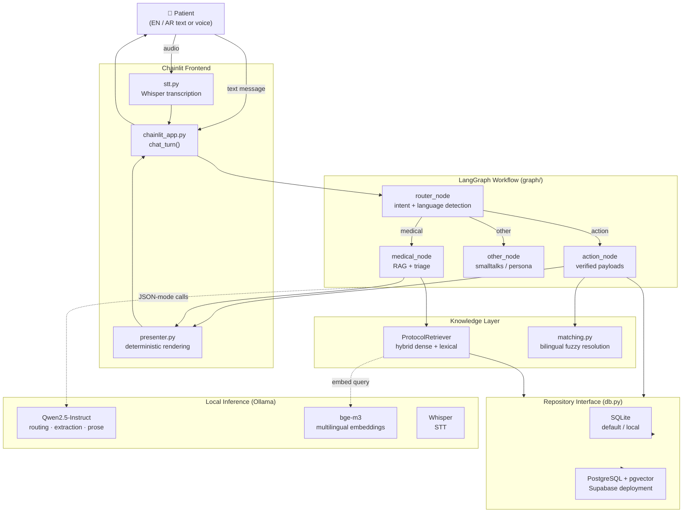

---

## 3. Core Design Principle

```
"LLM understands — deterministic code decides."
```

The architecture draws a hard boundary between what the model is trusted to
do and what it is never allowed to do:

| Responsibility | Owner | Rationale |
|---|---|---|
| Classify intent (medical / action / other) | LLM (narrow JSON question) | Needs natural language understanding |
| Detect user language (AR / EN) | Regex heuristic | Deterministic, no cost |
| Extract slot mentions from text | LLM (narrow JSON question) | Needs NLU |
| Resolve entity to database row | `matching.py` (code) | Must be correct — never guess |
| Interpret a confirmation reply (yes/no) | LLM (narrow JSON) + keyword fallback | Understands "اه"/"exactly" in any phrasing; code guards the write |
| Build structured booking payload | Code (from DB rows) | Hallucinated booking = lawsuit |
| Write appointment to DB | Code, only after explicit confirmation | Must be durable and verifiable |
| Write empathetic medical prose | LLM (prose, not JSON) | Style task — appropriate use |
| Render bilingual UI confirmation | `presenter.py` (code) | Must match payload exactly |
| Triage escalation decision | Code (protocol flag) | Safety-critical |

---

## 4. LangGraph Workflow

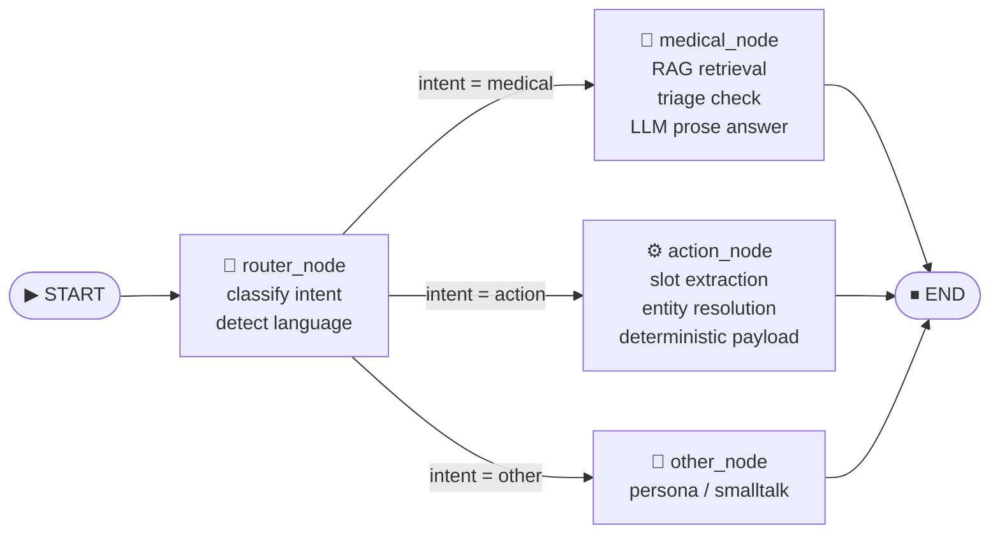

**State carried across turns** (`graph/state.py` — `ChatState`):

| Field | Type | Lifetime |
|---|---|---|
| `messages` | `list[dict]` (append-only) | Full conversation transcript |
| `language` | `str` ("ar" / "en") | Overwritten each turn |
| `intent` | `str` | Overwritten each turn |
| `action` | `str` | Overwritten each turn |
| `clinical` | `dict` | **Persists across turns** — carries `suggested_specialization_id` and `symptoms` so "yes book me" works without re-asking |
| `response` | `dict` | Current turn's output payload |

---

## 5. End-to-End Request Flow

### 5.1 Medical Query

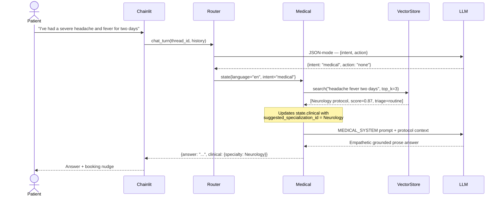

### 5.2 Booking Request (cross-turn slot-filling + confirmation)

Booking takes two turns: the resolved doctor/specialty/branch is surfaced for
confirmation first (nothing is written), then an explicit "yes" commits it.

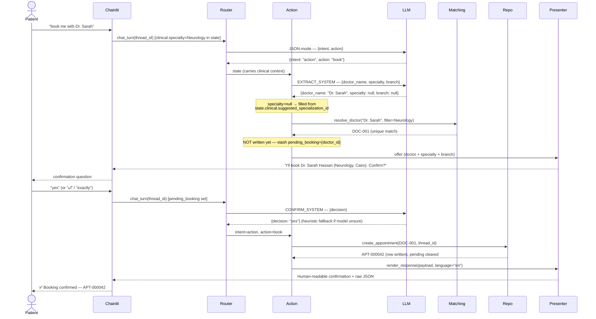

---

## 6. Hybrid Medical Retrieval (RAG)

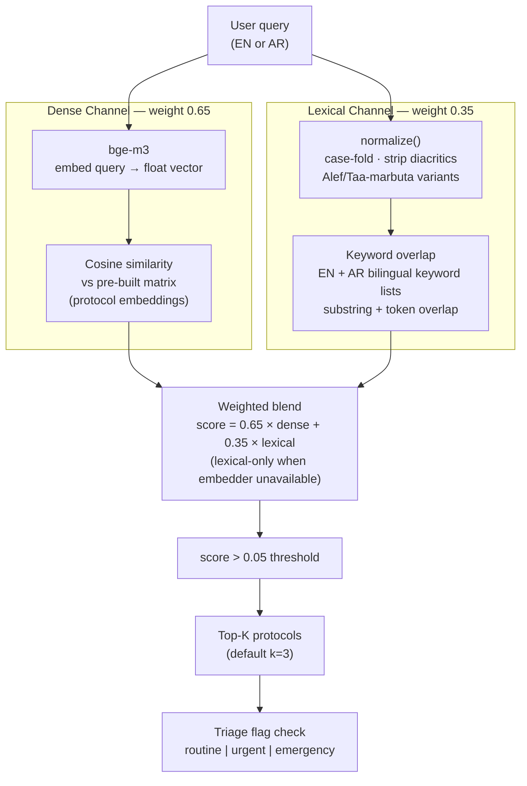

**Why hybrid?** Short Arabic symptom phrases (e.g. `ألم في الصدر`) are
substring hits that pure dense retrieval scores weakly. Dense embeddings
cover paraphrases and multilingual synonyms that keywords miss. The two
channels are complementary, and their blend degrades gracefully — if the
embedding model is not available, the lexical channel alone keeps the bot
grounded.

---

## 7. Bilingual Entity Resolution

All entity matching runs in `app/matching.py` — **no LLM involved**.

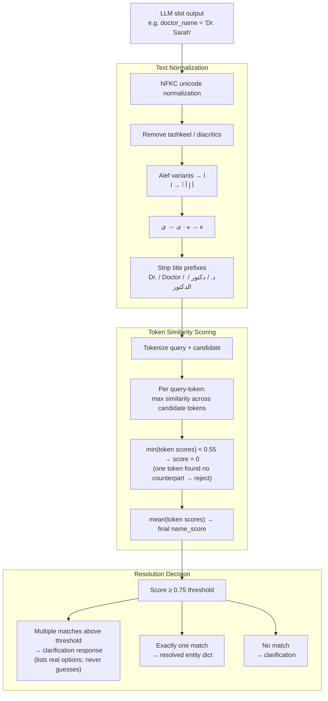

**Example**: `"د. سارة"` → strip title → `"سارة"` → token-match against
`"سارة حسن"` → score 1.0 (prefix hit) → **DOC-001**.

**Ambiguity refusal**: `"Dr. Hassan"` matches both `Dr. Hassan Ali` and
`Dr. Hassan Omar` → the bot lists both real names and asks the patient to
choose. It never picks one silently.

---

## 8. Booking Lifecycle

```mermaid
stateDiagram-v2
    direction LR

    [*] --> MedicalTurn : Patient describes symptoms

    MedicalTurn --> ClinicalContext : Protocol matched<br/>specialty stored in state.clinical

    ClinicalContext --> SlotExtraction : Patient says "book me"<br/>or "yes, appointment"

    SlotExtraction --> EntityResolution : LLM extracts doctor_name,<br/>specialty, branch mentions

    EntityResolution --> SpecialtyFallback : specialty = null
    SpecialtyFallback --> AmbiguityCheck : filled from state.clinical

    EntityResolution --> AmbiguityCheck : specialty provided

    AmbiguityCheck --> Clarification : Several doctors match<br/>(by name, specialty, or branch)
    Clarification --> EntityResolution : Patient adds specialty / branch / picks

    AmbiguityCheck --> Offer : Unique match

    Offer --> AwaitConfirm : surface doctor+specialty+branch<br/>pending_booking set, nothing written
    AwaitConfirm --> Offer : unclear reply → re-ask yes/no
    AwaitConfirm --> Aborted : "no" → nothing written
    AwaitConfirm --> WriteDB : "yes" (LLM-understood, heuristic fallback)

    WriteDB --> Confirmed : appointments row written<br/>APT-XXXXXX assigned

    Confirmed --> Listed : "list my bookings"
    Confirmed --> CancelRequest : "cancel my booking"

    CancelRequest --> AmbiguousCancel : Multiple active bookings
    AmbiguousCancel --> CancelRequest : Patient names the doctor<br/>or gives APT-XXXXXX

    CancelRequest --> Cancelled : Unique match<br/>status flipped in DB

    Cancelled --> [*]
    Aborted --> [*]
    Listed --> [*]
```

**Payload contract** — the graph returns a **pure structured payload**, never
a mix of prose and data. Example confirmed booking payload:

```json
{
  "action": "book",
  "appointment_id": "APT-000042",
  "doctor_name": "Dr. Sarah Hassan",
  "doctor_name_ar": "د. سارة حسن",
  "specialty": "Neurology",
  "hospital": "DMS Medical Group",
  "branch": "Cairo",
  "status": "confirmed"
}
```

The payload is built entirely from database rows — the model never produces
field values.

---

## 9. Conversation Persistence & Memory

Two independent persistence layers are tied together by a single **thread ID**:

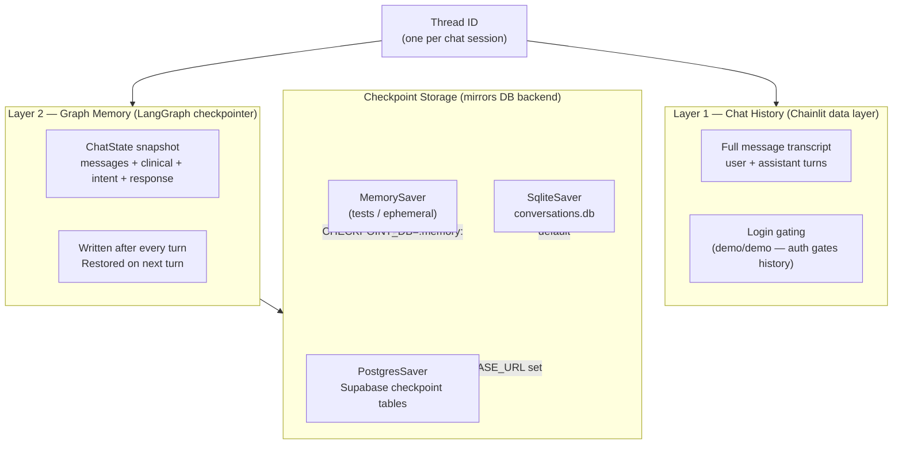

**Graceful degradation chain**: Postgres → SQLite → in-memory.
A checkpointing failure can never take the chatbot down.

**The persistence demo**: restart the process, reopen the same thread from
the sidebar → "cancel my booking" still works because the full `ChatState`
(including `clinical.suggested_specialization_id`) was checkpointed to
Supabase on the previous turn.

---

## 10. Storage Backends

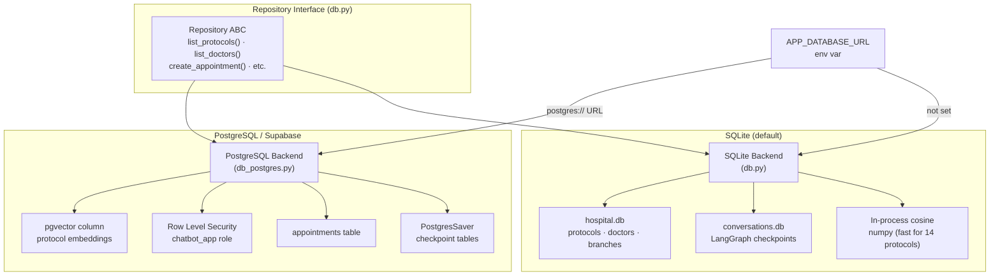

> **Key insight**: the graph never imports `db_postgres` or `db` directly — it
> only calls `get_repository(config)` which returns the right implementation.
> The interface is the seam; both sides of it are proven by shipping both.

**Supabase note**: Chainlit's data layer intercepts a bare `DATABASE_URL`
environment variable and can exhaust the session pooler.
`APP_DATABASE_URL` is used instead to avoid this collision.

---

## 11. Triage Escalation

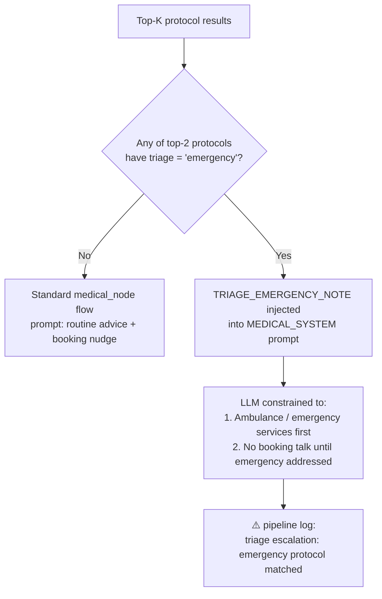

**Triage levels** stored on each protocol: `routine` · `urgent` · `emergency`.

The escalation is entirely **code-driven** — the LLM prompt is rewritten
based on a flag in the database row, not on the model's interpretation of
the severity. A model that decides to book an appointment for active chest
pain is a product liability risk; this architecture makes that structurally
impossible.

---

## 12. Presentation Layer

`app/presenter.py` converts structured payloads to bilingual human-readable
text with **zero LLM calls** and **zero latency**.

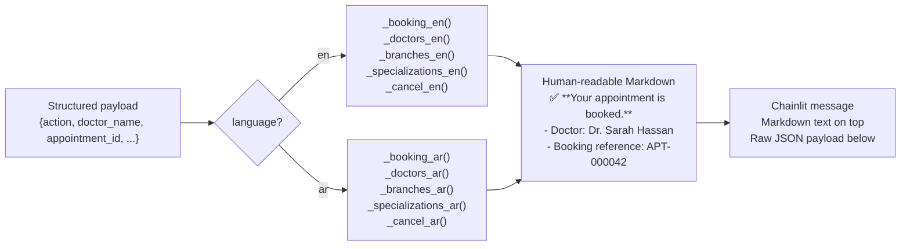

The text is derived 1:1 from verified payload fields — it can never
contradict the machine-readable data shown below it.

---

## 13. Testing Strategy

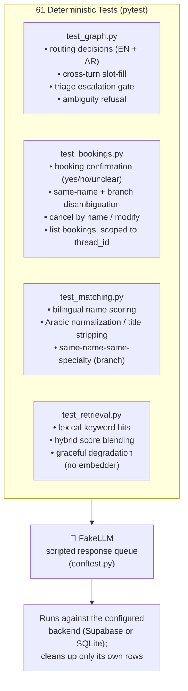

**Testing philosophy**: the suite tests the system's *guarantees*, not the
model's output. `FakeLLM` returns scripted responses so every assertion is
deterministic — routing, entity resolution, booking confirmation, payload
construction, and refusal behavior are all verifiable without a running Ollama
server. The tests run against whichever backend `.env` selects, so with
`APP_DATABASE_URL` set they exercise Supabase end-to-end.

**Two-layer bug defenses** (from live testing) — prompts improve the odds, code
guarantees the outcome:
1. Extractor emitting `"Neurology"` as `doctor_name` → prompt fix **+** guard
   that rejects a doctor_name matching a known specialty.
2. Router emitting contradictory `intent=medical + action=list_doctors` →
   prompt fix **+** code coercion: a named action overrides the intent.
3. Triage escalating on a weak emergency hit → score threshold on the match.
4. Booking-edit hallucinating a reschedule → deterministic cancel-and-rebook.
5. Confirmation missing a colloquial "اه" → LLM classifier with keyword fallback.
6. A vague follow-up ("the pain comes and goes") overwriting a strong clinical
   specialty → only overwrite when the new match clears a confidence threshold.
7. A wrong carried specialty dropping the user's *stated* branch → the doctor
   resolver relaxes filters in trust order (keeps the stated branch before the
   carried specialty). Each fix adds a regression test.

---

## 14. Configuration & Deployment

All settings are environment variables (`.env` or shell). No code change is
needed to switch backends or model providers.

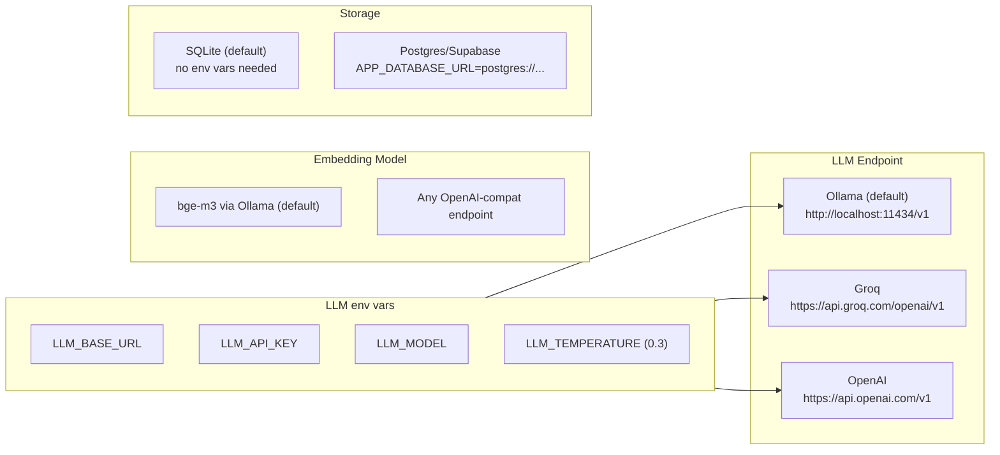

| Variable | Default | Purpose |
|---|---|---|
| `LLM_BASE_URL` | `http://localhost:11434/v1` | LLM endpoint (OpenAI-compatible) |
| `LLM_API_KEY` | `ollama` | API key |
| `LLM_MODEL` | `qwen2.5:7b-instruct` | Model name |
| `LLM_TEMPERATURE` | `0.3` | Inference temperature |
| `EMBED_MODEL` | `bge-m3` | Embedding model |
| `APP_DATABASE_URL` | *(not set)* | Postgres/Supabase URL → activates PG backend |
| `DB_BACKEND` | auto-detected | `"sqlite"` or `"postgres"` |
| `CHECKPOINT_DB` | `data/conversations.db` | LangGraph checkpoint file; `:memory:` for tests |

### Quick start

```bash
# install
pip install -r requirements.txt

# run all tests (no Ollama needed)
python -m pytest tests/ -q

# start the chatbot (Ollama must be running with qwen2.5:7b-instruct + bge-m3)
chainlit run app/chainlit_app.py
```

---

## 15. Known Limitations

| Limitation | Location | Path to fix |
|---|---|---|
| No availability / slots model — booking always succeeds | `appointments` table | Add a `slots` table; `create_appointment` checks availability |
| Bookings scoped to thread, not patient identity | `userIdentifier` in data layer | Per-patient accounts with cross-device history |
| One branch per doctor | hospital schema | Many-to-many doctor ↔ branch rota table |
| Script-based language detection — fully romanised Arabic (`"3andi sodaa3"`) treated as English | `detect_language()` in `nodes.py` | Small character-n-gram language classifier |
| 14 protocols — demo knowledge base only | `data/hospital_dataset.json` | Clinician-owned corpus with review workflow |
| No availability check or rate limiting | — | Day-one production items |
| Dialect-specific symptom vocabulary is limited | keyword lists | Native-speaker curation; dialect-specific Whisper fine-tune |

---

## 16. Functional Requirements Coverage

Every functional requirement in the task specification maps to a concrete
mechanism in the codebase.

| # | Requirement | How it is met | Where |
|---|---|---|---|
| 1 | **Context-aware conversation** — follow-ups without repetition | Per-thread LangGraph checkpointing keeps the full transcript **and** a `clinical` slot-filling context across turns | `graph/state.py`, checkpointer §9 |
| 1 | **Understands Arabic and English** | Script-based language detection per turn; bilingual retrieval, matching, prompts, and presenter | `nodes.py`, §6, §7, §12 |
| 2 | **Accepts symptom descriptions** | `medical_node` handles free-text symptom input | §5.1 |
| 2 | **Clear, empathetic recommendation in the user's language** | `MEDICAL_SYSTEM` prompt forces empathy, language-matching, and no hard diagnosis | `prompts.py`, §3 |
| 2 | **Suggests booking after every medical answer** | The medical prompt ends every answer with a booking offer phrased as a question | `prompts.py` |
| 3 | **Responses grounded in the hospital dataset (not general knowledge)** | Constrained-context RAG: retrieved protocols are injected as the *only* permitted medical source | §6 |
| 3 | **Retrieves relevant dataset content** | Hybrid dense + lexical retrieval over the protocol KB | §6 |
| 4 | **Distinguish action requests vs. medical questions** | `router_node` classifies intent into `medical` / `action` / `other` | §4, §5 |
| 4 | **Actions return structured data, medical returns text — never a mix** | The graph returns a **pure** payload OR prose, never both (presenter is a separate UI layer) | §8, §12 |
| 5 | **Look up branches** | `list_branches` action | `db.py`, §8 |
| 5 | **Look up specializations per branch** | `list_specializations` action | `db.py`, §8 |
| 5 | **Look up doctors (name + specialty)** | `list_doctors` action | `db.py`, §8 |
| 6 | **Identify doctor, specialty, branch from the conversation** | LLM slot extraction + cross-turn fallback from `clinical` context | §5.2, §7 |
| 6 | **Match against real data → verified structured booking** | `matching.py` resolves every mention to a DB row; payload built from rows only | §7, §8 |
| 6 | **Payload has enough info to proceed (name, specialty, branch, hospital + IDs)** | Booking payload includes `doctor_id`, `specialty_id`, `branch_id`, and human-readable names | §8 |
| 7 | **Voice input (optional)** | `stt.py` (faster-whisper) transcribes AR/EN audio → routed as a normal message | High-level architecture, §2 |

**Beyond the spec** (product-judgment additions): triage escalation for
emergencies (§11), full booking *lifecycle* — list and cancel, not just create
(§8), dual persistence surviving restarts (§9), a deterministic bilingual
presenter (§12), pipeline observability logging, and a 42-test suite that runs
without a model server (§13).

---

## 17. Deliverables Coverage

| Deliverable (from the task) | Status | Location |
|---|---|---|
| **Full source code** | ✅ | `app/`, `tests/`, `scripts/` |
| README — overall approach & system design | ✅ | `README.md` §1 + this document |
| README — AI model(s) used and why | ✅ | `README.md` §1 (model-choice table) |
| README — prompt design strategy | ✅ | `README.md` §3 |
| README — how to configure and run | ✅ | `README.md` §4, §7 |
| **Generated hospital test dataset** | ✅ | `data/hospital_dataset.json` — Al-Mashreq Medical Group: 3 branches, 8 specializations, 23 doctors (incl. deliberate same-name/same-branch collisions), 14 bilingual protocols |
| Example — multi-turn medical → booking suggestion | ✅ | `examples/01_multi_turn_medical_to_booking.md` (EN), `examples/02_arabic_medical_conversation.md` (AR) |
| Example — asking about doctors / specializations | ✅ | `examples/03_data_lookups.md` |
| Example — voice input transcribed & processed | ✅ | `examples/04_voice_input.md` |

All example transcripts are generated against the live system by
`scripts/generate_examples.py`, so they reflect real model behaviour rather
than hand-written ideals.

---

*Companion document to `README.md`. All diagram source is
[Mermaid](https://mermaid.js.org/) — renders natively in GitHub, GitLab, and
VS Code (Markdown Preview Mermaid Support extension).*
